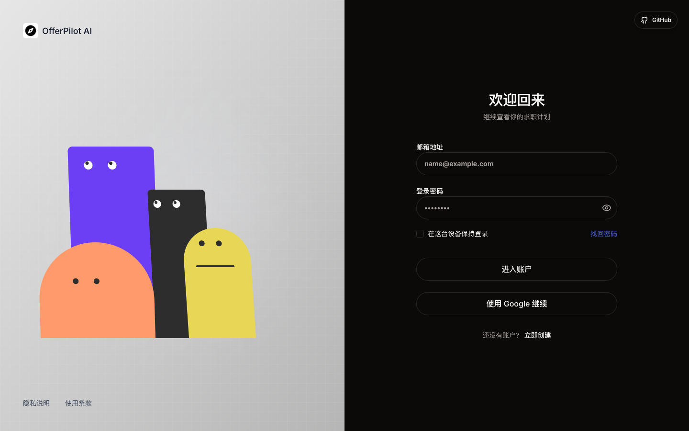

# OfferPilot AI Login Recreation

> 非官方学习性 fork / 复刻实验。参考来源：<https://careercompassai.vercel.app/login>



## 声明

本仓库仅用于前端学习、动效拆解与工程实现练习。页面视觉和交互动效参考了 `CareerCompass` 登录页：

<https://careercompassai.vercel.app/login>

本项目不是原站官方项目，也不代表原站或其作者。若原作者、权利方或相关方认为本仓库存在侵权、误导或不适当使用，请通过 GitHub 联系我，我会立即删除仓库或移除相关内容。

## 在线预览

- 预览地址：<https://shusfun.github.io/careercompassai/#/login>
- 源码仓库：<https://github.com/shusfun/careercompassai>

## 技术栈

- React
- Vite
- Tailwind CSS v4
- shadcn/ui 风格组件
- React Router
- GitHub Pages + GitHub Actions

## 实现思路

核心目标是复刻认证页的视觉结构和交互体验，同时替换为新的产品文案与品牌表达。

- 页面结构：使用 `AuthLayout` 统一登录、注册和找回密码页面的左右分栏布局。
- 路由组织：使用 `HashRouter` 适配 GitHub Pages 静态托管，避免刷新子路由时出现 404。
- 动效复刻：左侧角色不是图片或视频，而是使用 React 组件和 CSS 形状实现。
- 鼠标跟随：监听鼠标位置，计算角色身体倾斜、眼睛偏移和面部位置。
- 表单联动：邮箱聚焦、密码聚焦、密码输入、显示密码等状态会驱动角色反应。
- 按钮动效：按钮使用双层文本和滑入层，实现 hover 时的切换效果。
- 响应式处理：桌面展示左侧动效区域，移动端隐藏动效并保持表单完整可见。
- 部署预览：通过 GitHub Actions 构建 Vite 产物并发布到 GitHub Pages。

## 本地运行

```bash
npm install
npm run dev
```

本地开发端口固定为：

<http://localhost:43817/>

## 构建

```bash
npm run build
```
